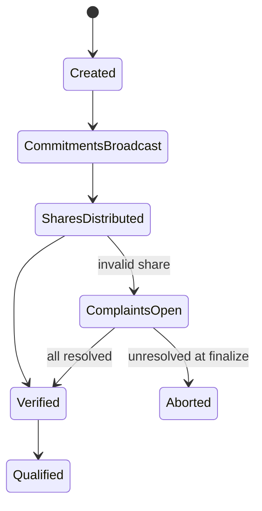

The Pedersen equation answers a local question: “Does my private share pair
match this public commitment vector?” A protocol must also answer: “Which
session is this, who is the dealer, who participates, did everyone see the same
vector, and when may we continue?”

Version 0.3 introduces these questions through `cryptocave_sss/vss_session.py`.
It is a single-process executable specification, not a network implementation.

## 1. Session state

The normal honest path is:



The implementation rejects operations that occur out of order. For example,
private shares cannot be distributed before commitments, and reconstruction is
not available until the state is `qualified`.

## 2. Public transcript

`SessionTranscript` binds the following public values:

| Field | Purpose |
|---|---|
| `protocol` and `version` | Domain-separate the meaning and encoding |
| `session_id` | Distinguish fresh executions and reduce replay ambiguity |
| `dealer_id` | Name the dealer in this local model |
| `participant_ids` | Fix the eligible nonzero Shamir labels |
| `threshold` | Fix the polynomial degree and reconstruction rule |
| group parameters | Fix $p,q,g,h$ |
| `commitments` | Fix the dealer's public polynomial commitment vector |

The fields are serialized as canonical JSON and hashed with SHA-256. Any change
to a bound field changes the transcript digest, except with a cryptographic hash
collision.

A transcript digest is an identifier, not proof of origin. Without a signature
or an authenticated channel, an attacker can construct a different transcript
and hash it too.

## 3. Commitment broadcast

If participant 1 sees vector $C$ while participant 2 sees vector $C'$, both may
accept shares from different polynomials. Local Pedersen checks do not detect
that split view. VSS therefore needs a common-broadcast property for public
commitments.

`ReliableCommitmentBoard` provides only an in-memory model of that property. It
records the first commitment vector under `(session_id, dealer_id)`:

- publishing the same vector again is idempotent;
- publishing a different vector raises `BroadcastEquivocationError`;
- the session moves to `aborted` after detected equivocation.

This works in the lesson because every local view refers to one shared Python
dictionary. A real reliable-broadcast protocol must tolerate faulty processes,
delayed or reordered messages, inconsistent peer views, authentication failure,
and explicit network assumptions. The class name describes the abstraction
being modeled, not a deployed guarantee.

## 4. Private share distribution

After the public commitment vector is fixed, the dealer gives each participant
exactly one `PedersenShare(x,value,blinding)`. Version 0.3 requires the received
identifier set to match the configured participant set exactly. Missing,
duplicate, or unknown identifiers are rejected before verification begins.

The share pairs are not inserted into the public transcript or `public_record`.
The session stores them in memory because it simulates all actors within one
process. A distributed implementation would deliver each share only to its
intended participant over an authenticated confidential channel.

## 5. Local verification

Each participant begins as `pending`. `verify_participant(i)` checks that
participant's pair against the common commitments:

- a valid pair changes the status to `accepted`;
- an invalid pair changes it to `complained` and opens a complaint;
- after all pending checks finish with no open complaints, the session becomes
  `verified`.

`verify_all()` is a convenience method for the single-process lesson. It should
not be mistaken for a centralized step required by Pedersen VSS.

## 6. Binding complaints to the session

A complaint includes the session identifier, participant identifier, transcript
digest, and verification reason. Its own identifier is a hash of those public
fields. A complaint from another session or commitment vector is rejected.

The complaint intentionally omits the private secret and blinding shares. This
prevents the public audit record from becoming a share-disclosure channel, but
it also means the record alone cannot convince outside observers which party
misbehaved. That limitation is handled explicitly in the next chapter.

## 7. Example

```python
session = VSSSession(vss, session_id="lesson-001", dealer_id="alice")
transcript = session.broadcast_commitments(distribution.commitments)
session.distribute_shares(list(distribution.shares))
session.verify_all()

assert session.state.value == "verified"
assert len(transcript.digest) == 64

session.finalize()
opened = session.reconstruct([1, 2, 3])
```

The full honest execution is in `examples/vss_session_demo.py`. Equivocation,
replay, and wrong-order cases are exercised by `tests/test_vss_session.py`.

Next: [Complaints, qualification, and abort](/series/threshold-cryptography-engineering/).
